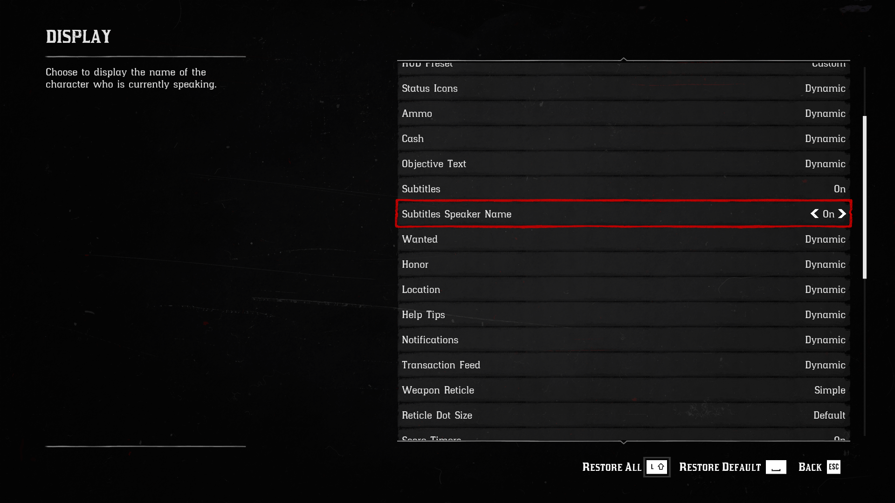

# UAC
Repository for the Universal Agent Control project.

Please setup your environment as:
```bash
conda create --name uac-dev python=3.10
conda activate uac-dev
pip3 install -r requirements.txt
```

### To install Faiss:
```bash
# CPU-only version
conda install -c pytorch faiss-cpu=1.7.4 mkl=2021 blas=1.0=mkl
```

### To install GroundingDino:

Download its weights to the cache directory:

```bash
mkdir cache
cd cache
curl -L -C - -O https://github.com/IDEA-Research/GroundingDINO/releases/download/v0.1.0-alpha/groundingdino_swinb_cogcoor.pth
cd ..
```

**Note:**
You should have a CUDA environment, please make sure you have properly installed CUDA dependencies first. You can use the following command to detect it on Linux.
```bash
nvcc -V
```

Or search for its environment variable: CUDA_HOME or CUDA_PATH. On Windows it should be something like "C:\Program Files\NVIDIA GPU Computing Toolkit\CUDA\v11.8" and on Linux like "/usr/local/cuda".

If you don't get the specific version, you should download cudatoolkit and cuDNN first (version 11.8 is recommended).

If you don't download CUDA correctly, after installing GroundingDino, the code will produce: 

```bash
NameError: name '_C' is not defined
```

If this happened, please re-setup CUDA and pytorch, reclone the git and perform all installation steps again.

On Windows install from https://developer.nvidia.com/cuda-11-8-0-download-archive (Linux packages also available).

Make sure pytorch is installed using the right CUDA dependencies.

```bash
conda install pytorch torchvision cudatoolkit=11.8 -c nvidia -c pytorch
```

If this doesn't work, or you prefer the pip way, you can try something like:

```bash
pip3 install --upgrade torch==2.1.1+cu118 -f https://download.pytorch.org/whl/torch_stable.html
pip3 install torchvision==0.16.1+cu118 -f https://download.pytorch.org/whl/torch_stable.html
```

Now, you should install the pre-compiled GroundingDino with the project dependencies. You can use the package in our repo and the following commands:

```bash
cd deps
pip install groundingdino-0.1.0-cp310-cp310-win_amd64.whl
cd ..
```

Once it is installed, we need to pre-download some required model files and set some environment variables.

```bash
# Define the necessary environment variables, this can be done in the .env file in the uac directory
HUGGINGFACE_HUB_CACHE = "./cache/hf" # This can be the full path too, if the relative one doesn't work

# Pre-download huggingface files needed by GroundingDino
# This step may require a VPN connection
mkdir $HUGGINGFACE_HUB_CACHE
huggingface-cli download bert-base-uncased config.json tokenizer.json vocab.txt tokenizer_config.json model.safetensors --cache-dir $HUGGINGFACE_HUB_CACHE

# Define the last necessary environment variable, this can be done in the .env file in the uac directory
# This step will avoid needing a VPN to run
TRANSFORMERS_OFFLINE = "TRUE"
```

If for some reason there is some incompatibility in installing or running GroundingDino, it's recommended to recreate your environment.

Only if really necessary, you can try to clone and compile/install GroundingDino yourself.

```bash
# Clone
cd ..
git clone https://github.com/IDEA-Research/GroundingDINO.git
cd GroundingDINO

# Build and install it
pip3 install -r requirements.txt
pip3 install .
cd ../UAC
```

It should install without errors and now it will be available for any project using the same conda environment (uac-dev).

To build the C++ code on Windows, you may need to install build tools.

Download them from https://visualstudio.microsoft.com/visual-cpp-build-tools/
Make sure to select "Desktop Environment with C++" and include the 1st 3 optional packages:
- MSVC v141 or higher
- Windows SDK for your OS version
- CMake tools

### To install the videosubfinder for gather information module

Download the videosubfinder from https://sourceforge.net/projects/videosubfinder/ and extract the files into the res/tool/subfinder folder.

The file structure should be like this:
- res
  - tool
    - subfinder
      - VideoSubFinderWXW.exe
      - test.srt
      - ...

#### Tunning the videosubfinder
Use res/tool/general.clg to overwrite res/tool/subfinder/settings/general.cfg file.   
To get the best extraction results, you can tune the subfinder by changing the parameters in the settings/general.cfg file. You may follow the readme me in Docs folder to get more information about the parameters.
Only modify it if absolutely necessary. Values have already been tuned to game scenario and environment setup.

### Other dependencies

Keep the UAC requirements.txt file updated in your branch, but only add dependencies that are really required by the system.

runner.py is the entry point to run an agent. Currently not working code, just an introductory sample.

## General guidelines

Always, **always**, **ALLWAYS** get the latest /main branch.

Any file with text content in the project in the resources directory (./res) should be in UTF-8 encoding. Use the uac.utils to open/save files.


## Infra code

### 1. OpenAI provider

OpenAI provider now can expose embeddings and LLM from OpenAI and Azure together. Users only need to create one instance of each and pass the appropriate configuration.

Example configurations are in /conf. To avoid exposing sensitive details, keys and other private info should be defined in environmental variables.

The suggested way to do it is to create a .env file in the root of the repository (never push this file to GitHub) where variables can be defined, and then mention the variable names in the configs.

Please check the examples below.

Sample .env file containing private info that should never be on git/GitHub:
```
OA_OPENAI_KEY = "abc123abc123abc123abc123abc123ab"
AZ_OPENAI_KEY = "123abc123abc123abc123abc123abc12"
AZ_BASE_URL = "https://abc123.openai.azure.com/"
```

Sample config for an OpenAI provider:
```
{
	"key_var" : "OA_OPENAI_KEY",
	"emb_model": "text-embedding-ada-002",
	"comp_model": "gpt-4-vision-preview",
	"is_azure": false
}
```

### 2. Prompt definition files

Prompt files are located in the repo at ./res/prompts. Out of the code tree.

There three types of prompt-related files: input_example, output_example, and templates. Examples are json files. Templates are text files with special markers inside. See details below.

Inside each of these directories, most files will fit into three categories: decision_making, gather_information, and success_detection

Files are named according to the format: ./res/prompts/\<type\>/\<category\>_\<sub_task\>.\<ext\>

For example: 
./res/**input_example**/**decision_making**_**follow_red_line**.json, is an example of **input** for the **decision making** prompt for the **follow the red line** sub-task. In the future, most filenamess will end in "_general", when they are not sub-task-specific anymore.

As shown below, such "input_example" files illustrate the **parameters** needed to fill a prompt "template".
Not all input examples need the same parameters. Only the parameters required the corresponding specific template (".prompt" file).

Also, in most situations the format of the parameter "output-format" (if it exists) must be exactly the same as the corresponding "output_example" json file.

**>>> Allways check the /main branch for the latest examples!!!**

## Game & Skill Libraryg


### 1. Change settings before running the code.

#### 1.1 Mouse mode
Change mouse mode in the control setting to DirectInput.
| Original interface | Changed interface |
|------------|------------|
|  |  |  

#### 1.2 Control
Change both two 'Tap and Hold Speed Control' to on, so we can press w twice to run, saving the need to press shift. Also change 'Aiming Mode' to 'Hold To Aim', so we do not need to keep pressing mouse right button when aiming.
| Original interface | Changed interface |
|------------|------------|
|  |  |  

#### 1.3 Game screen
Use Win+Tab to open two desktops. Put the code on the right desktop and open the game in the left desktop. The recommended default resolution to use is 1920x1080, but it can vary if the **16:9** aspect ratio is preserved. This means your screen must be of size (1920,1080), (2560,1440) or (3840,2160). DO NOT change the aspect ratio. Also, remember to set the game Screen Type to **Windowed Borderless**.


#### 1.4 Mini-map
Remember to enlarge the icon to ensure the program is working well following: `SETTING -> DISPLAY ->  Radar Blip Size = Large` and  `SETTING -> DISPLAY ->  Map Blip Size = Large` and  `SETTING -> DISPLAY ->  Radar = Expanded` (or press Alt + X).


#### 1.4 Subtitles
Enable to show the speaker's name in the subtitles.



### 2. Three libraries for keyboard & mouse control  

- pyautogui: Used to simulate mouse clicks, including long mouse presses.   
- pydirectinput: Used to simulate the operation of the keyboard.  
- ahk: Used to simulate mouse swiping, including moveTo and dragTo.
  
### 3. File Structure
Most of our code are in the uac/gameio and uac/utils.

#### 3.1 uac/gameio/atomic_skills:
move.py: Includes turn, move_forward, mount horse and dismount horse.

map.py: Includes the operations needed to open the map and manipulate with the map.    

sell.py: Includes the actions needed to sell our products.    

buy.py: It is mainly divided into three parts:   
-   1. Interact with shopkeeper to buy products.   
-   2. The extra work required to buy clothes.   
-   3. Buy products on shelves.  

trade_utils.py: Stores the functions used to buy and sell products when trading.  

If you're just buying things from camp to town, you might at involve the following functions (for example: Buying fruit can):   

In the map.py:
-   open_map
-   close_map
-   add_waypoint
-   open_index
-   close_index
-   confirm_selection
-   select_down_index_object
-   select_up_index_object

In the buy.py
-   browse_catalogue
-   view_next_page
-   view_previous_page
-   select_product_type
-   buy_product
    

In the trade_utils.py
-   shopkeeper_interaction
-   cancel_shopkeeper_interaction
-   select_products
-   confirm_selection

#### 3.2 uac/gameio/composite_skills:
Currently, we only have 'cv_navigation' as a composite skill. Includes calculate_turn_angle (between the red line in the mini-map and the normal line, which is used in the cv_navigation).

#### 3.4 uac/gameio/lifecycle/ui_control.py
Contains code for switch game and code between two desktops and take_screenshot of the game.


## Running examples

We provide two "toy" examples so far.

4.1 openai_runner.py shows how to use the OpenAI provider and call GPT-4V directly to test prompts.

4.2 runner.py the agent run, involving other components.

The generated direction_map in the runs/<timestamp> should have a green line cross the white arrow and parallel to the red line (overlayed by the generated blue lines).
 


## Known issues
- You need to use time.sleep() between the execution of two skills for now.
- Planning and success detection sometimes not ideal.
- Very high latency and call errors in GPT-4V API.
