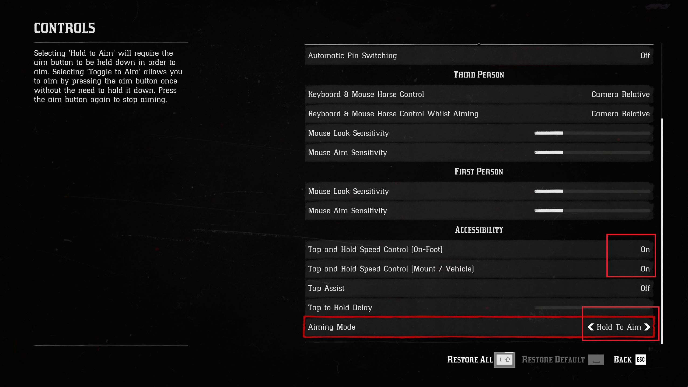

# UAC
Repository for the Universal Agent Control project.

Please setup your environment as:
```bash
conda create --name uac-dev python=3.10
conda activate uac-dev
pip3 install -r requirements.txt
```

To install Faiss:
```bash
# CPU-only version
conda install -c pytorch faiss-cpu=1.7.4 mkl=2021 blas=1.0=mkl
# GPU(+CPU) version
conda install -c pytorch -c nvidia faiss-gpu=1.7.4 mkl=2021 blas=1.0=mkl
```

Keep the requirements.txt file updated in your branch, but only add dependencies that are really required by the system.

runner.py is the entry point to run an agent. Currently not working code, just an introductory sample.

## Infra code

### 1. OpenAI provider

OpenAI provider now can expose embeddings and LLM from OpenAI and Azure together. Users only need to create one instance of each and pass the appropriate configuration.

Example configurations are in /conf. To avoid exposing sensitive details, keys and other private info should be defined in environmental variables.

The suggested way to do it is to create a .env file in the root of the repository (never push this file to GitHub) where variables can be defined, and then mention the variable names in the configs.

Please check the examples below.

Sample .env file containing private info that should never be on git/GitHub:
```
OA_OPENAI_KEY = "abc123abc123abc123abc123abc123ab"
AZ_OPENAI_KEY = "123abc123abc123abc123abc123abc12"
AZ_BASE_URL = "https://abc123.openai.azure.com/"
```

Sample config for an OpenAI provider:
```
{
	"key_var" : "OA_OPENAI_KEY",
	"emb_model": "text-embedding-ada-002",
	"comp_model": "gpt-4-vision-preview",
	"is_azure": false
}
```

## Game & Skill Library
### 1. Change settings before running the code.

#### 1.1 Mouse mode
Change mouse mode in the control setting to DirectInput.
| Original interface | Changed interface |
|------------|------------|
|  |  |  

#### 1.2 Control
Change both two 'Tap and Hold Speed Control' to on, so we can press w twice to run, saving the need to press shift. Also change 'Aiming Mode' to 'Hold To Aim', so we do not need to keep pressing mouse right button when aiming.
| Original interface | Changed interface |
|------------|------------|
|  |  |  

#### 1.3 Game screen
Use Win+Tab to open two desktops. Put the code on the right desktop and open the game in the left desktop. The game should be scriptly at the top-left corner of the screen. The recommended default resolution to use is 2560x1440, but it can vary if the 16:9 aspect ratio is preserved. DO NOT change the aspect ratio.


im
#### 1.3 Mini-map
Press Alt and press X to make the mini-map expand.
 

### 2. Three libraries for keyboard & mouse control  
- pyautogui: Used to simulate mouse clicks, including long mouse presses.   
- pydirectinput: Used to simulate the operation of the keyboard.  
- ahk: Used to simulate mouse swiping, including moveTo and dragTo.
  
### 3. File Structure
Most of our code are in the uac/skill_library and uac/utils.

#### 3.1 uac/skill_library/atomic_skills:
move.py: Includes turn, move_forward, mount horse and dismount horse.

map.py: Includes the operations needed to open the map and manipulate with the map.    

sell.py: Includes the actions needed to sell our products.    

buy.py: It is mainly divided into three parts:   
-   1. Interact with shopkeeper to buy products.   
-   2. The extra work required to buy clothes.   
-   3. Buy products on shelves.  
  
trade_utils.py: Stores the functions used to buy and sell products when trading.  

main.py: Calls functions from other python files.

If you're just buying things from camp to town, you might at involve the following functions(for example:Take buying fruit can):   
  
In the map.py:
-   open_map
-   close_map
-   add_waypoint
-   open_index
-   close_index
-   confirm_selection
-   select_down_index_object
-   select_up_index_object

In the buy.py
-   browse_catalogue
-   view_next_page
-   view_previous_page
-   select_product_type
-   buy_product
    
In the trade_utils.py
-   shopkeeper_interaction
-   cancel_shopkeeper_interaction
-   select_products
-   confirm_selection

#### 3.2 uac/skill_library/composited_skills:
Currently, we only have the cv_navigation as the composited skill.

#### 3.3 uac/utils/angle_estimator.py:
Used for calcualte the angle between the red line in the mini-map and the normal line, which is used in the cv_navigation.

#### 3.4 uac/utils/UI_control.py
Contains code for switch game and code between two desktops and take_screenshot of the game.
You need to modify the screen_region and mini_map_region to fit your settings.

### 4. Toy examples
We provide two toy examples so far.

4.1 runner.py shows how to use the OpenAI provider.

4.0 For the cv_navigation and map operation in skill_example.py. Modify the screen_region and mini_map_region to fit your screen at first. 

The generated direction_map in the runs/test1 should have a green line cross the white arrow and parallel to the red line (overlayed by the generated blue lines).
 


### 5. Known issues
-   You need to use time.sleep() between the execution of two skills.

